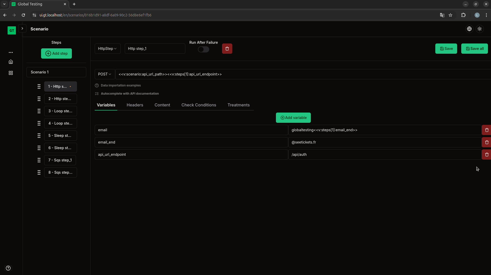

<div align="center">
    
    <h1><b>Global Testing</b></h1>
</div>
<p align="center">
  <p align="center"><b>The open-source test management platform</b>: Test your entire service flow effortlessly with our intuitive interface to guarantee communication and availability of your services.</p>
</p>

<h4 align="center">
  <a href="https://github.com/SeeTicketsFr/Global-Testing/blob/main/LICENSE">
    
  </a>
  <a href="https://github.com/SeeTicketsFr/Global-Testing/blob/main/CONTRIBUTING.md">
    
  </a>
</h4>



# Table of content

-  [Introduction](#introduction)
-  [Getting started](#getting-started)
    -  [Run Global-Testing locally](#run-global-testing-locally)
-  [Contributing](#contributing)

## Introduction

**Global-Testing** is the open source test management platform that teams use to test their entire service flow effortlessly (without developer experience and knowledge) to ensure communication and availability of their services.

We're on a mission to make test tooling more accessible to everyone, not just developers teams.

## Features

- **Dashboard**: Manage tests (named scenarios) through a user-friendly interface.
    - **Scenario**: Create scenarios including steps to test your stack.
    - **Step Autocompletion**: Autocomplete your step information (url, method, headers, content, etc.) with api documentations.
    - **Data importation**: Import any data (fake data, response from a previous step, variable, etc.) with a simple syntax.
    - **Execution**: Execute your test with real time execution logs.
    - **Executions History with metrics** : See previous executions logs and metrics.
    - **Logs**: Simple logs for non-developers and detailed logs for developers.
    - **Schedule**: Schedule your scenarios with a cron.
- **Translation**: Two languages ​​available (English, French)

## Getting started

### Run Global-Testing locally

To set up and run Global-Testing locally, make sure you have Git, Docker and mkcert installed on your system. Then run the command for your system:

#### Linux/macOS:

Clone the project
```console
git clone https://github.com/SeeTicketsFr/Global-Testing.git
```

Copy .env.example files
```
cd Global-Testing/ && cp .env.example .env
```
```
cd back/ && cp .env.example .env
```

Run containers - Production
```
docker compose up -d
```
Run containers - Development
```
docker compose -f compose.dev.yml up -d
```

#### Windows Command Prompt:

Clone the project
```console
git clone https://github.com/SeeTicketsFr/Global-Testing.git
```

Copy .env.example files
```
cd Global-Testing && copy .env.example .env
```
```
cd back/ && copy .env.example .env
```

Run containers - Production
```
docker compose up -d
```
Run containers - Development
```
docker compose -f compose.dev.yml up -d
```

## Contributing

Whether it's big or small, we love contributions.